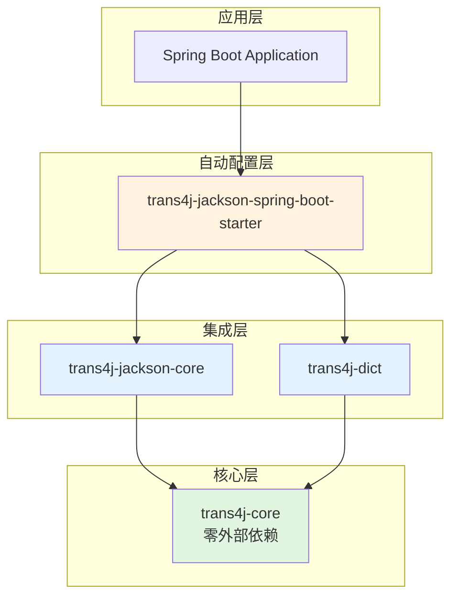
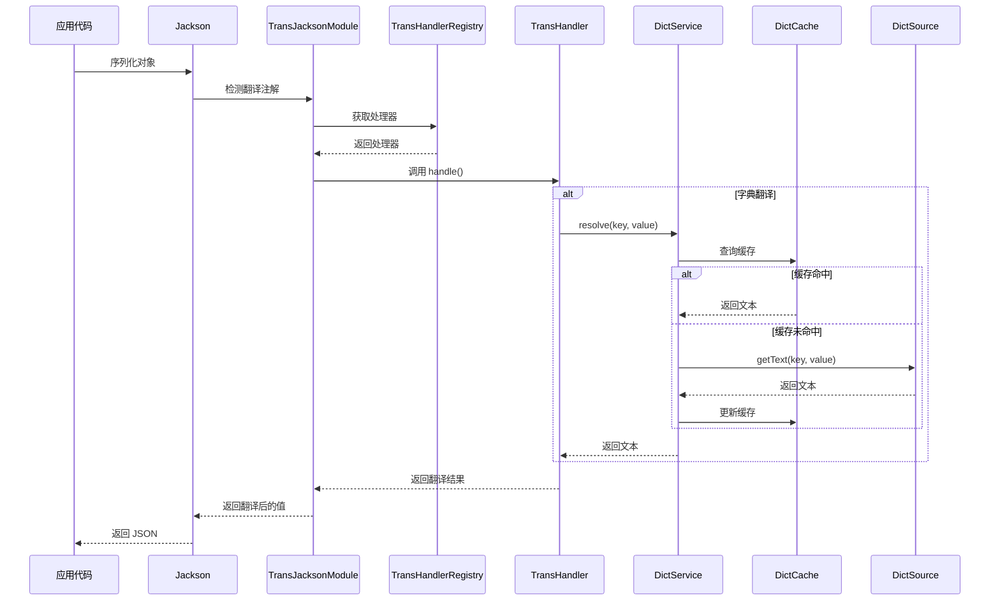

# trans4j

> 一个优雅、高性能的字段翻译框架，支持日期、数字和字典翻译，与 Jackson 和 Spring Boot 无缝集成。

[](LICENSE)
[](https://www.oracle.com/java/)
[](https://spring.io/projects/spring-boot)

## ✨ 特性

- 🎯 **零侵入**：通过注解即可实现字段翻译，无需修改业务代码
- 🚀 **高性能**：智能缓存机制，减少重复查询
- 🔧 **易扩展**：提供清晰的接口和 SPI 机制，轻松实现自定义翻译处理器
- 📦 **开箱即用**：Spring Boot Starter 自动配置，无需手动注册
- 🎨 **模块化设计**：清晰的模块边界，按需引入依赖
- 🔄 **多类型支持**：内置日期、数字、字典翻译，支持自定义扩展

## 📦 模块说明

trans4j 采用模块化设计，各模块职责清晰，依赖关系简单：

### trans4j-core

**核心抽象层，零外部依赖**

- 提供翻译处理器接口 `TransHandler`
- 提供处理器注册表 `TransHandlerRegistry`
- 定义翻译注解：`@TransDate`、`@TransNumber`、`@TransDict`
- 内置日期和数字翻译处理器（通过 SPI 自动加载）

**依赖关系**：无外部依赖（仅依赖 Java 标准库）

### trans4j-dict

**字典翻译扩展模块**

- 提供字典数据源接口 `DictSource`（用户实现）
- 提供字典缓存接口 `DictCache`
- 提供字典服务 `DictService`
- 实现字典翻译处理器 `DictTransHandler`
- 内置内存缓存实现 `InMemoryDictCache`

**依赖关系**：仅依赖 `trans4j-core`

### trans4j-jackson-core

**Jackson 集成模块**

- 提供 `TransJacksonModule`，集成所有已注册的翻译处理器
- 支持 Jackson 2.x 和 Jackson 3.x
- 在序列化时自动应用翻译处理器

**依赖关系**：依赖 `trans4j-core` 和 Jackson（provided scope）

### trans4j-jackson-spring-boot-starter

**Spring Boot 自动配置模块**

- 自动配置 `TransJacksonModule`
- 条件装配字典翻译功能（当存在 `DictSource` bean 时）
- 支持自定义 `DictCache` 实现

**依赖关系**：依赖 `trans4j-jackson-core`、`trans4j-dict` 和 Spring Boot（provided scope）

### 模块依赖图



## 🚀 快速开始

### 1. 引入依赖

#### Maven

```xml
<dependency>
    <groupId>io.github.oiltea</groupId>
    <artifactId>trans4j-jackson-spring-boot-starter</artifactId>
    <version>1.0.0</version>
</dependency>
```

#### Gradle

```gradle
implementation 'io.github.oiltea:trans4j-jackson-spring-boot-starter:1.0.0'
```

### 2. 实现字典数据源（可选）

如果需要使用字典翻译功能，实现 `DictSource` 接口：

```java
@Component
public class DatabaseDictSource implements DictSource {

    @Autowired
    private DictMapper dictMapper;

    @Override
    public Optional<String> getText(String dictKey, String itemValue) {
        // 从数据库查询单个字典项
        DictItem item = dictMapper.selectByKeyAndValue(dictKey, itemValue);
        return Optional.ofNullable(item).map(DictItem::getText);
    }

    @Override
    public Map<String, String> getEntries(String dictKey) {
        // 查询整个字典（用于缓存预热）
        List<DictItem> items = dictMapper.selectByKey(dictKey);
        return items.stream()
            .collect(Collectors.toMap(DictItem::getValue, DictItem::getText));
    }
}
```

### 3. 使用注解

#### 日期翻译示例

```java
public class OrderVO {
    
    @TransDate(beginOfDay = true)
    private Date startDate;  // 2024-01-15 14:30:00 -> 2024-01-15 00:00:00
    
    @TransDate(endOfDay = true)
    private LocalDateTime endDate;  // 2024-01-15 14:30:00 -> 2024-01-15 23:59:59.999999999
}
```

#### 数字翻译示例

```java
public class ProductVO {
    
    @TransNumber(scale = 2)
    private BigDecimal price;  // 99.999 -> 100.00
    
    @TransNumber(scale = 0, roundingMode = RoundingMode.DOWN)
    private BigDecimal quantity;  // 10.8 -> 10
}
```

#### 字典翻译示例

```java
public class UserVO {
    
    private Long id;
    
    @TransDict(key = "GENDER", refs = {"genderText"})
    private String gender;  // "M"
    
    private String genderText;  // "男"（自动填充）
    
    @TransDict(key = "STATUS", suffix = "Name")
    private String status;  // "ACTIVE"
    
    private String statusName;  // "激活"（自动填充）
}
```

### 4. 序列化输出

使用 Jackson 序列化时，翻译会自动应用：

```java
@RestController
public class UserController {
    
    @GetMapping("/users/{id}")
    public UserVO getUser(@PathVariable Long id) {
        UserVO user = userService.getUser(id);
        // Jackson 序列化时自动应用翻译
        return user;
    }
}
```

输出 JSON：

```json
{
  "id": 1,
  "gender": "M",
  "genderText": "男",
  "status": "ACTIVE",
  "statusName": "激活"
}
```

## 📖 注解文档

### @TransDate

日期翻译注解，用于将日期调整到一天的开始或结束时间。

**支持的类型**：
- `java.util.Date`
- `java.time.LocalDateTime`

**属性**：

| 属性 | 类型 | 默认值 | 说明 |
|------|------|--------|------|
| `beginOfDay` | boolean | false | 是否转换为当天开始时间（00:00:00.000000000） |
| `endOfDay` | boolean | false | 是否转换为当天结束时间（23:59:59.999999999） |

**使用示例**：

```java
public class TimeRangeQuery {
    
    @TransDate(beginOfDay = true)
    private Date startTime;  // 转换为 00:00:00
    
    @TransDate(endOfDay = true)
    private Date endTime;    // 转换为 23:59:59.999999999
}
```

### @TransNumber

数字翻译注解，用于数字格式化和舍入。

**支持的类型**：
- `java.math.BigDecimal`

**属性**：

| 属性 | 类型 | 默认值 | 说明 |
|------|------|--------|------|
| `scale` | int | - | 小数位数（必填） |
| `roundingMode` | RoundingMode | HALF_UP | 舍入模式 |

**使用示例**：

```java
public class PriceVO {
    
    @TransNumber(scale = 2)
    private BigDecimal price;  // 保留两位小数，四舍五入
    
    @TransNumber(scale = 0, roundingMode = RoundingMode.DOWN)
    private BigDecimal count;  // 取整，向下舍入
}
```

### @TransDict

字典翻译注解，用于将字典代码翻译为文本。

**支持的类型**：
- 任意类型（会调用 `toString()` 方法）

**属性**：

| 属性 | 类型 | 默认值 | 说明 |
|------|------|--------|------|
| `key` | String | - | 字典类型键（必填） |
| `refs` | String[] | {} | 目标字段名数组（可选） |
| `suffix` | String | "Text" | 字段名后缀（当 refs 为空时使用） |

**使用示例**：

```java
public class UserVO {
    
    // 方式1：使用默认后缀 "Text"
    @TransDict(key = "GENDER")
    private String gender;
    private String genderText;  // 自动填充
    
    // 方式2：自定义后缀
    @TransDict(key = "STATUS", suffix = "Name")
    private String status;
    private String statusName;  // 自动填充
    
    // 方式3：指定多个目标字段
    @TransDict(key = "ROLE", refs = {"roleName", "roleDesc"})
    private String role;
    private String roleName;
    private String roleDesc;
}
```

## 🏗️ 架构设计

### 核心组件

#### TransHandler

翻译处理器接口，定义翻译逻辑的抽象：

```java
public interface TransHandler<T extends Annotation, V, R> {
    
    /**
     * 获取支持的注解类型
     */
    Class<T> getAnnotationType();
    
    /**
     * 获取支持的原始值类型
     */
    Class<V> getValueType();
    
    /**
     * 检查是否支持指定的类型
     */
    default boolean supportsType(Class<?> type) {
        return getValueType().isAssignableFrom(type);
    }
    
    /**
     * 处理翻译逻辑
     */
    R handle(T annotation, V value);
}
```

#### TransHandlerRegistry

处理器注册表，管理所有翻译处理器：

- 支持 SPI 自动发现（无依赖的处理器）
- 支持运行时动态注册（有依赖的处理器）
- 线程安全的并发访问

#### 数据流图



### 工作流程

1. **初始化阶段**（应用启动时）
   - SPI 自动加载无依赖的处理器（DateTransHandler、NumberTransHandler）
   - Spring Boot 自动配置创建 DictTransHandler（如果存在 DictSource）
   - 所有处理器注册到 TransHandlerRegistry

2. **序列化阶段**（Jackson 序列化时）
   - Jackson 检测字段上的翻译注解
   - 从 TransHandlerRegistry 获取对应的处理器
   - 调用处理器的 handle() 方法执行翻译
   - 将翻译结果写入目标字段或替换原字段值

3. **字典查询阶段**（字典翻译时）
   - 优先查询缓存
   - 缓存未命中时查询数据源
   - 更新缓存并返回结果

## 🔧 扩展指南

### 实现自定义 TransHandler

创建自定义翻译处理器非常简单：

#### 步骤1：定义注解

```java
@Retention(RetentionPolicy.RUNTIME)
@Target(ElementType.FIELD)
public @interface TransPhone {
    boolean mask() default true;  // 是否脱敏
}
```

#### 步骤2：实现 TransHandler

```java
public class PhoneTransHandler implements TransHandler<TransPhone, String, String> {
    
    @Override
    public Class<TransPhone> getAnnotationType() {
        return TransPhone.class;
    }
    
    @Override
    public Class<String> getValueType() {
        return String.class;
    }
    
    @Override
    public String handle(TransPhone annotation, String value) {
        if (value == null || !annotation.mask()) {
            return value;
        }
        // 手机号脱敏：138****5678
        if (value.length() == 11) {
            return value.substring(0, 3) + "****" + value.substring(7);
        }
        return value;
    }
}
```

#### 步骤3：注册处理器

**方式1：使用 SPI（推荐用于无依赖的处理器）**

创建文件 `META-INF/services/io.github.oiltea.trans4j.core.handler.TransHandler`：

```
com.example.PhoneTransHandler
```

**方式2：运行时注册（推荐用于有依赖的处理器）**

```java
@Configuration
public class CustomHandlerConfig {
    
    @Bean
    public PhoneTransHandler phoneTransHandler() {
        PhoneTransHandler handler = new PhoneTransHandler();
        TransHandlerRegistry.getInstance().register(handler);
        return handler;
    }
}
```

### 实现自定义 DictCache

如果内置的内存缓存不满足需求，可以实现自定义缓存：

#### 步骤1：实现 DictCache 接口

```java
@Component
public class RedisDictCache implements DictCache {
    
    @Autowired
    private RedisTemplate<String, String> redisTemplate;
    
    @Override
    public Optional<String> get(String dictKey, String itemValue) {
        String key = buildKey(dictKey, itemValue);
        String value = redisTemplate.opsForValue().get(key);
        return Optional.ofNullable(value);
    }
    
    @Override
    public void put(String dictKey, String itemValue, String text) {
        String key = buildKey(dictKey, itemValue);
        redisTemplate.opsForValue().set(key, text, 1, TimeUnit.HOURS);
    }
    
    @Override
    public void evict(String dictKey, String itemValue) {
        String key = buildKey(dictKey, itemValue);
        redisTemplate.delete(key);
    }
    
    @Override
    public void evictAll(String dictKey) {
        String pattern = "dict:" + dictKey + ":*";
        Set<String> keys = redisTemplate.keys(pattern);
        if (keys != null && !keys.isEmpty()) {
            redisTemplate.delete(keys);
        }
    }
    
    @Override
    public void clear() {
        String pattern = "dict:*";
        Set<String> keys = redisTemplate.keys(pattern);
        if (keys != null && !keys.isEmpty()) {
            redisTemplate.delete(keys);
        }
    }
    
    private String buildKey(String dictKey, String itemValue) {
        return "dict:" + dictKey + ":" + itemValue;
    }
}
```

#### 步骤2：注册为 Bean

Spring Boot 会自动使用你的自定义实现：

```java
@Configuration
public class CacheConfig {
    
    @Bean
    public DictCache dictCache(RedisTemplate<String, String> redisTemplate) {
        return new RedisDictCache(redisTemplate);
    }
}
```

### SPI 机制说明

trans4j 使用 Java SPI（Service Provider Interface）机制来实现插件化扩展。

#### 什么是 SPI？

SPI 是 Java 提供的一种服务发现机制，允许在运行时动态加载接口的实现类。

#### 如何使用 SPI？

1. **定义服务接口**：`TransHandler`
2. **实现服务接口**：创建具体的处理器类
3. **配置服务提供者**：在 `META-INF/services/` 目录下创建配置文件
4. **加载服务**：使用 `ServiceLoader` 加载实现类

#### SPI 配置示例

文件路径：`META-INF/services/io.github.oiltea.trans4j.core.handler.TransHandler`

文件内容：

```
io.github.oiltea.trans4j.core.handler.DateTransHandler
io.github.oiltea.trans4j.core.handler.LocalDateTimeTransHandler
io.github.oiltea.trans4j.core.handler.NumberTransHandler
```

#### 何时使用 SPI？

- ✅ **适合**：无依赖的处理器（如 DateTransHandler、NumberTransHandler）
- ❌ **不适合**：有依赖的处理器（如 DictTransHandler，需要 DictService）

对于有依赖的处理器，推荐使用运行时注册方式。

## 🎯 最佳实践

### 1. 选择合适的模块

- 只需要日期/数字翻译？引入 `trans4j-jackson-core`
- 需要字典翻译？引入 `trans4j-jackson-spring-boot-starter`
- 需要自定义处理器？依赖 `trans4j-core` 并实现 `TransHandler`

### 2. 缓存策略

- 小型字典（< 1000 条）：使用 `InMemoryDictCache`
- 大型字典或分布式环境：实现 Redis 缓存
- 高频访问字典：在应用启动时预热缓存

### 3. 性能优化

- 实现 `DictSource.getEntries()` 方法支持批量加载
- 合理设置缓存过期时间
- 避免在循环中频繁调用字典翻译

### 4. 错误处理

- 字典项不存在时，返回原值或空字符串
- 数据源异常时，记录日志并返回降级值
- 使用 `@TransDict` 时确保目标字段存在

## 🤝 贡献

欢迎提交 Issue 和 Pull Request！

## 📄 许可证

本项目采用 [Apache License 2.0](LICENSE) 许可证。

## 👤 作者

**oiltea**

- Email: oiltea@qq.com
- GitHub: [@oiltea](https://github.com/oiltea)

## 🙏 致谢

感谢所有为本项目做出贡献的开发者！
